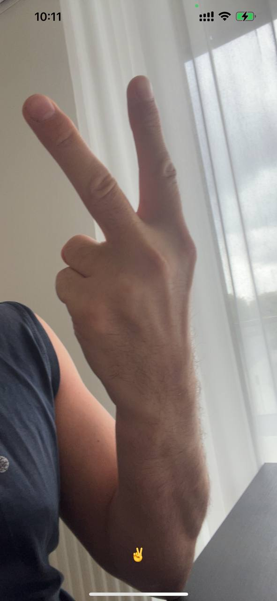

# 📦 Apple Vision Framework - Classification/Detection 

 5 Demo apps - to show possibilities of 
 Apple Vision framework which detects and classify 
 different things on the photo.  
It can be used for real-time mode, together with phone camera plus simple math
to interpret humans, qr-codes, text, hand and face parts.

---

## 🚀 Features

- iOS UIKit.
- Vision framework.

---

## 🖼 Screenshots

### FacePartsDetection
#### "Not smiling" detection. Emoji at the bottom.


### FacePartsDetection
#### "smiling" detection.


### HandClasification



### HandClasification


### HandClasification 


### HumanDetection


### QrCodeDetection


### TextDetection


---

## 🛠 Setup

```
## Python
git clone https://github.com/genry86/Classification_Face_Parts.git
cd Classification_Face_Parts
pip3 install -r requirements.txt

python data_download.py # to download CalebA dataset from kagglehub
python dataset_prepare.py # clean-up csv file and copy/split all photos to tran/val/test folders.

Use "pt" folder to work with pytorch. "train.py"
User "tf" to work with tensorflow. "train.py"

"test_models.py" file is used to show visual results of both generated models.
"convert_to_coreml.py" is used to convert both models to CoreML format, in order to be used on iOS phones.

 ## iOS
cd iOS
pod install
run ImageClassification.xcworkspace
# iOS will use real-time front camera to get image of your face to detect landmarks. Result photos will go to through trained models(Pytorch and Tensorflow). Results will be showed on the screen. 
